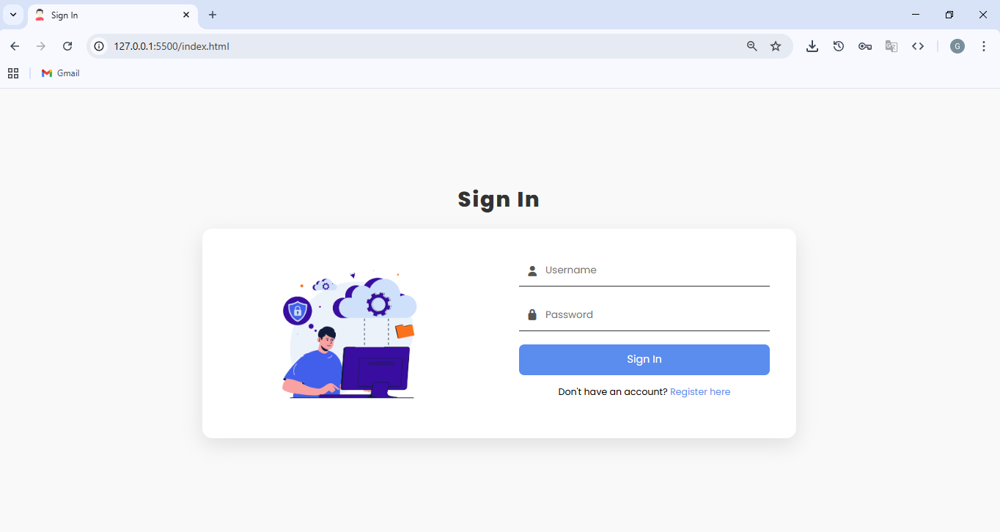
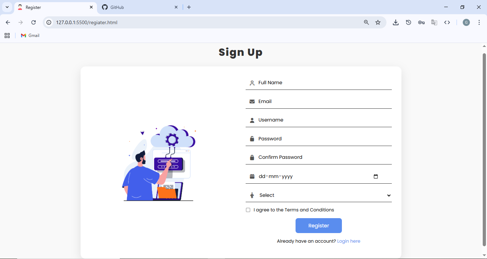

# SignUp-SignIn Web App

A simple, modern, and responsive Sign Up / Sign In web application built with HTML, CSS, and JavaScript. This project demonstrates basic client-side form validation, user registration, and login simulation using localStorage.

## Features

- **Sign Up Page**: Register with full name, email, username, password, date of birth, and gender.
- **Sign In Page**: Log in with username and password.
- **Form Validation**: Real-time client-side validation for all fields.
- **Responsive Design**: Looks great on desktop and mobile devices.
- **Modern UI**: Clean, attractive interface with icons and images.
- **LocalStorage**: Simulates user registration and login (no backend required).

## Folder Structure

```
index.html           # Sign In page
regiater.html        # Sign Up page (typo: should be 'register.html')
assets/
  css/
    register.css     # Styles for registration page
    signIn.css       # Styles for sign in page
  img/
    register.jpg     # Image for registration page
    signin.jpg       # Image for sign in page
  js/
    register.js      # JS for registration logic
    signIn.js        # JS for sign in logic
```

## How It Works

- **Registration**: User fills out the registration form. On successful validation, the username and password are saved to `localStorage`.
- **Sign In**: User enters credentials. The app checks `localStorage` for a match and displays a success or error message.
- **No Backend**: All logic is client-side for demonstration/learning purposes only.

## Getting Started

1. **Clone the repository**
   ```
   git clone <repo-url>
   ```
2. **Open `index.html` in your browser**
   - Use any local server or just double-click the file.

## Screenshots




## Notes
- This project is for educational/demo purposes. Do **not** use this approach for real authentication or production use.
- The file `regiater.html` is a typo; it should be `register.html`.

## License

MIT License
